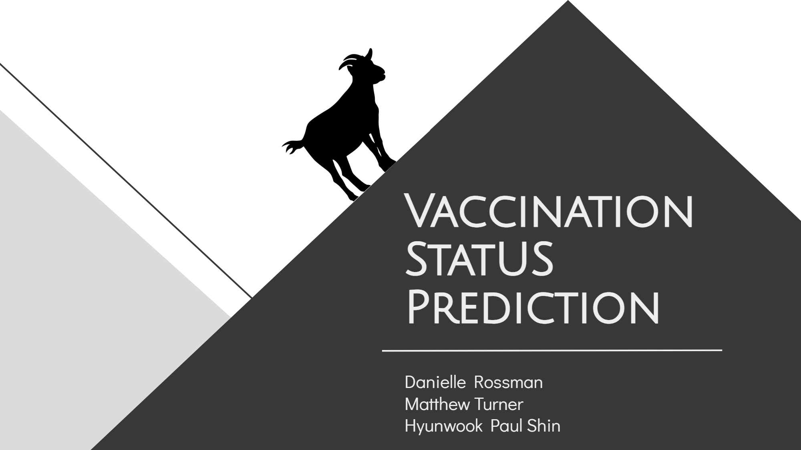

# Flatiron GOATs Vaccination Prediction
Data sourced from [DataDriven](https://www.drivendata.org/competitions/66/flu-shot-learning/page/210/)

**Authors**:

- [Danielle Rossman](https://github.com/dmrossm)
- [Matthew Turner](https://github.com/austint1121)
- [Hyunwook Paul Shin](https://github.com/hps1795)


## Overview


The fictional mayor of the fictional city, Goat city, TN,  is ordering Covid vaccines, and is fully aware that not
everyone will choose to get vaccinated. Goat city wants to know how many Covid vaccines they should be ordering.
They have hired us, the Flatiron GOATS, to assist them with this task.

National 2009 H1N1 Flu Survey collected to monitor vaccination rates during that campaign. This phone survey asked
people whether they had received H1N1 vaccines, in conjunction with information they shared about their lives, opinions,
and behaviors. We want to use this data to create a model that can predict if a person received the H1N1 Vaccine based on
their responses to the questions in the survey. Then advise Goat City to use the model we have created with the
provided H1N1 survey data to now predict the number of COVID-19 vaccines needed.


- Our model predicted that **Goat city should order 8309** doses of the H1N1 vaccine, and **it would cost ~$66,472**.


- Goat city actually **ordered 5674 doses** of the H1N1 vaccine,and spent **~$45,932 on vaccine doses**.

Our model was off by **~2,635 doses, a difference of $20,540**

Given the ~80% accuracy of this model, we can confidently advise Goat City to conduct an updated
survey, targeting the same demographic features, but shifting the survey questions regarding vaccines and likelihood of
illness to focus on the current COVID-19 epidemic. We then advise Goat City to use the model we have created with the
provided H1N1 survey data to now predict the number of COVID-19 vaccines needed.

***
## Business Problem
The mayor of Goat city  is ordering Covid vaccines, and is fully aware that not everyone will choose to get vaccinated.
Goat city wants to know how many Covid vaccines they should be ordering. We want to show them that using a survey to
predict if a person will get a vaccine is a valid way of estimating how many vaccines to order.

***

## Data
**Data sourced from [DataDriven](https://www.drivendata.org/competitions/66/flu-shot-learning/page/210/)**

Datadriven's description of the dataset says:

>Vaccines for H1N1 were first publicly available in the United States in October 2009, when the United States government
> began a vaccination campaign. We will look at data from the National 2009 H1N1 Flu Survey collected to monitor
> vaccination rates during that campaign. This phone survey asked people whether they had received H1N1 and seasonal flu
> vaccines, in conjunction with information they shared about their lives, opinions, and behaviors.
> A better understanding of how these characteristics have been associated with personal vaccination patterns may
> provide guidance for future public health efforts.

Full documentation of the dataset can be found on the [CDC website](https://www.cdc.gov/nchs/nis/data_files_h1n1.htm)
***

## Preprocessing 
For the preprocessing, all of the columns are categorical, however, some of them are numerical, and some of them are strings. We will want to handle these columns differently when imputing missing values.

- **Numerical Categories**
    - Use Sklearn's [Iterative Imputer](https://scikit-learn.org/stable/modules/generated/sklearn.impute.IterativeImputer.html_) to fill in the missing values
- **String Categories**
    - Fill missing values with a new value: 'unknown'
    - One hot encode the results
- **Categories with more then 10 unique categories**
  - We will frequency code these instead, so we don't have an overwhelming amount of columns in the dataframe.

***

## Modeling Results
For our final model, we used the [Catboost](https://catboost.ai/en/docs/) algorithm. Our model was able to achieve an 80% accuracy score.


According to our data, Goat city would have needed 5674 doses of the H1N1 vaccine, and would have spent ~$45,932 on vaccine doses.

If our model predicted that Goat city should order 8309 doses of the H1N1 vaccine, and it would have cost ~$66,472.


***

## Conclusions

- Our final model was able to predict the number of vaccines used during the 2009 H1N1 epidemic
(for the sample provided), with an error that was equivalent to a total dollar cost of ~$21,000.


- We now feel, that given the ~80% accuracy of this model, we can confidently in advise Goat City to conduct an updated
survey, targeting the same demographic features, but shifting the survey questions regarding vaccines and likelihood of
illness to focus on the current COVID-19 epidemic. We then advise Goat City to use the model we have created with the
provided H1N1 survey data to now predict the number of COVID-19 vaccines needed.


***

## Information

Please review our full analysis in [our Jupyter Notebook](https://github.com/austint1121/Flatiron_GOATS_Vaccination_Prediction/blob/main/Final%20Notebook.ipynb)
or our [presentation](https://github.com/austint1121/Flatiron_GOATS_Vaccination_Prediction/main/presentation.pdf)

## Repository Structure

```
├── Images                              <- Folder containing graphs and images from notebooks and presentation
│   └── ...
├── Notebooks                           <- Directory containing individual group members' notebooks
│   ├── Danielle                  
│   │   └── ...
│   ├── Matthew                  
│   │   └── ...
│   └── Paul                  
│       └── ...
├── Final Notebook.ipynb                <- Narrative documentation of project in Jupyter notebook
├── README.md                           <- Top-level README 
├── functions.py                        <- Helper functions for "Final Notebook.ipynb"
└── presentation.pdf                    <- PDF version of project presentation
``` 
